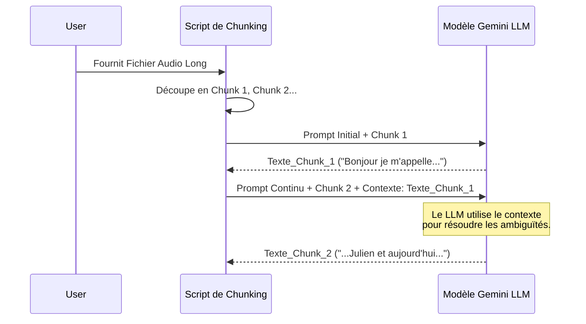

# Tutoriel: Maîtriser la Transcription Audio Longue Durée avec Gemini et Google Speech

Gérer la transcription de longs fichiers audio (comme des podcasts ou des conférences) est un défi majeur en ingénierie IA. Les modèles de Speech-to-Text (STT) et les LLMs multimodaux comme Gemini ont des limites de durée (souvent 60 secondes pour les API STT classiques) ou des fenêtres de contexte limitées.

Dans ce tutoriel, nous explorons comment l'architecture de ce dépôt relève le défi du "chunking" audio et comment elle évalue rigoureusement ses propres performances.

## Le Défi de la Segmentation Audio (Chunking)

Lorsque votre fichier dépasse les limites de l'API, vous devez le découper. Ce dépôt propose deux stratégies principales.

### Stratégie 1 : Le Découpage Strict (Hard Split)

La méthode naïve consiste à couper l'audio toutes les 59 secondes de manière mathématique.

**Avantages :** Extrêmement rapide et prédictible (Latence $O(1)$). Parfait pour les systèmes en temps réel où le délai doit être constant.
**Inconvénients :** Coupe les mots en deux. Si vous coupez "Bonjour" à 59s, l'API recevra "Bon" et "jour" séparément, détruisant le sens et augmentant le taux d'erreur.

### Stratégie 2 : Le Découpage Intelligent par Silences

Pour éviter de tronquer les mots, le dépôt utilise une approche plus intelligente via la librairie `pydub`.

```python
def get_audio_sequence(file, min_silence_len=500):
    from pydub import AudioSegment, silence
    myaudio = AudioSegment.from_mp3(file)
    dBFS = myaudio.dBFS

    # Détection initiale des silences basée sur l'énergie (-20 décibels)
    speak_sequences = silence.detect_nonsilent(
        myaudio, min_silence_len=min_silence_len, silence_thresh=dBFS-20, seek_step=10
    )
    return speak_sequences

def process_fileV2(file_name, _stt):
    # ... initialisation ...
    min_silence_len = 600
    speak_sequences = get_audio_sequence(file_name, min_silence_len)
    speak_sequences_too_big = [(start, stop) for start, stop in speak_sequences if stop - start > 59000]

    # Boucle de repli: Si un segment est trop long, on est moins exigeant sur ce qu'on appelle "un silence"
    while(len(speak_sequences_too_big) > 0 and min_silence_len != 100):
      min_silence_len = min(min_silence_len-100, 100)
      speak_sequences = get_audio_sequence(file_name, min_silence_len)
      speak_sequences_too_big = [(start, stop) for start, stop in speak_sequences if stop - start > 59000]
```

**Avantages :** Des coupures "propres" entre les phrases, préservant la sémantique et la grammaire. Crucial pour alimenter un LLM comme Gemini.
**Inconvénients :** Gourmand en ressources. Si une personne parle vite sans faire de pause pendant une minute, la boucle `while` va forcer le système à recalculer les silences plusieurs fois sur le même fichier, ralentissant le traitement.

## L'Astuce : Propager le Contexte avec Gemini

Lorsqu'on utilise un LLM comme Gemini pour du STT, le dépôt utilise une technique de "Prompting Continu" très efficace.

```python
  while (isFinished == False):
    if len(result) > 0:
      # L'astuce magique : Réinjecter le texte transcrit précédemment
      previous_text = "".join(result)
      prompts = [audio, prompt_continue, previous_text]
    else:
      prompts = [audio, prompt]

    response = model.generate_content(prompts, ...)
```



Au lieu d'isoler chaque segment, le script passe le texte du segment précédent (`previous_text`) au modèle lors de l'appel suivant.
**Le gros avantage ?** Cela aide le LLM à garder le contexte, à résoudre les homophones de manière cohérente, et à maintenir l'orthographe des noms propres d'un chunk à l'autre.

## Comment savoir si le modèle est bon ? Benchmarking avancé

Le dépôt ne se contente pas de transcrire ; il utilise le sous-dossier `benchmark` pour quantifier la qualité en utilisant deux métriques très différentes :

```python
def evaluate_data(predictions, references, verbose= False):
    # ... nettoyage ...
    scores = evaluator.evaluate(predictions, references) # Semantic Textual Similarity
    wer = wer_metric.compute(references=references, predictions=predictions) # Word Error Rate
    return wer, scores['semantic_textual_similarity']
```

1.  **WER (Word Error Rate) via `jiwer`/`evaluate` :** C'est la mesure classique. Si le modèle oublie un mot ou fait une faute d'orthographe, le WER augmente. **Avantage:** Mesure la justesse absolue. **Inconvénient:** Très punitif. Écrire "ouais" au lieu de "oui" explose le score, même si le sens est le même.
2.  **Semantic Textual Similarity (STS) via `sequence-evaluate` :** Une approche moderne ! Au lieu de regarder mot à mot, le système utilise des embeddings (vecteurs de sens) pour comprendre si la *phrase produite* a la même signification que la *vérité terrain*. **Avantage:** Parfait pour évaluer les LLMs qui ont tendance à reformuler intelligemment. **Inconvénient:** Lourd à calculer.

En enregistrant systématiquement ces deux métriques dans BigQuery (`save_results_df_bq`), l'architecture permet de prendre des décisions éclairées sur le compromis entre le coût du modèle (Gemini Flash vs Pro, API Speech v1 vs v2) et la qualité réelle perçue par l'utilisateur.
